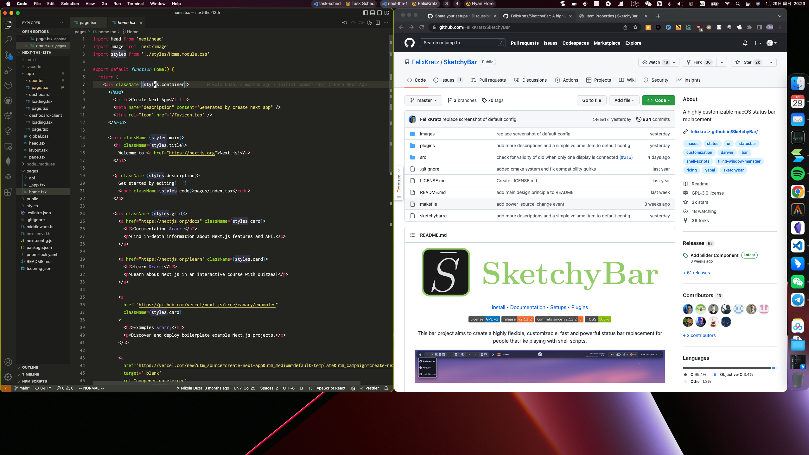

My SketchyBar setup mentioned at https://github.com/FelixKratz/SketchyBar/discussions/47#discussioncomment-4808906



Features

- Overlays the macOS native menubar (transparent background, coexists with native items)
- Shows space numbers as keyboard shortcut hints, with app icons and titles
- Updates on window/space changes via yabai signals (with animation)
- Configurable app list via JSON — no recompilation needed
- Single static binary, zero runtime dependencies

## Prerequisites

- macOS (Apple Silicon)
- [Homebrew](https://brew.sh/)
- [sketchybar](https://github.com/FelixKratz/SketchyBar) — `brew install FelixKratz/formulae/sketchybar`
- [yabai](https://github.com/koekeishiya/yabai) — `brew install koekeishiya/formulae/yabai`
- [Hack Nerd Font](https://www.nerdfonts.com/) — `brew install --cask font-hack-nerd-font`
- [Go](https://go.dev/) — `brew install go` (build only)

## Install

```sh
git clone https://github.com/user/sketchybar-config.git
cd sketchybar-config
make install
```

This will:
1. Build the binary
2. Install to `~/.config/sketchybar/`
3. Copy `config.example.json` → `config.json` (first install only)
4. Register yabai signals so the bar updates on window changes
5. Restart sketchybar

## Uninstall

```sh
make uninstall
```

## Configuration

Edit `~/.config/sketchybar/config.json`:

```json
{
  "maxTitleLength": 12,
  "apps": [
    {
      "id": "Google Chrome",
      "icon": "U+F02AF",
      "color": "0xfff1bf47",
      "stripSuffix": " - Google Chrome"
    }
  ]
}
```

The `id` is the `.app` bundle name (e.g., `"Finder"` from `Finder.app`), which is
language-independent — unlike localized display names. Check `/Applications/` or
run `ps -e -o comm=` to find your app's bundle name.

### App fields

| Field | Required | Description |
|---|---|---|
| `id` | yes | `.app` bundle name (language-independent). Use `"*"` as catch-all for unlisted apps |
| `icon` | yes | Nerd Font icon — hex code (`"U+F02AF"`) or raw unicode char |
| `color` | no | Icon color in `0xAARRGGBB` format |
| `stripSuffix` | no | Remove this suffix from window title |
| `titleSeparator` | no | Split title by this string |
| `titlePart` | no | Which part after split (0=first, -1=last) |
| `hideTitle` | no | Show only icon, no title |

Find icons at [nerdfonts.com/cheat-sheet](https://www.nerdfonts.com/cheat-sheet).

After editing config.json, restart sketchybar to apply:

```sh
brew services restart sketchybar
```
