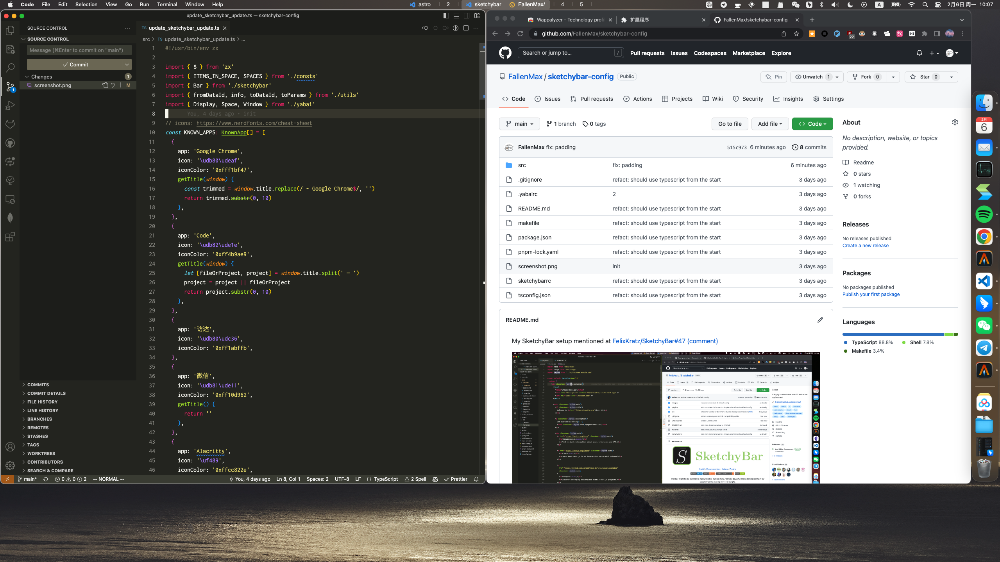

My SketchyBar setup mentioned at https://github.com/FelixKratz/SketchyBar/discussions/47#discussioncomment-4808906

Features

- Displays app titles and updates on change
  - I'm not using spaces for fixed purposes. I just allocate any new task to a free space, so it's nice to know how spaces are used and their purpose from a glance
- Co-exists with macos native menubar
  - Native menubar is nice and useful, I like it, also I'm using [MenubarX](https://menubarx.app/)
- Written in javascript
  - Easier to maintain for complex logic (a.k.a. I can't write bash)

Requirements:

- node.js (to run the script)
- yabai (query window info)
- [zx](https://github.com/google/zx) (provides some nice cli utilities)
- [flock](https://github.com/discoteq/flock) (to prevent multiple instances of the script)
- (Optional) [chokidar-cli](https://www.npmjs.com/package/chokidar-cli) (to watch for changes in the script, making developing easier)

Known issues:

- After upgrading macos to Ventura, bar items jitter when update, no idea how to fix it yet
- Does not update when moving a window to another space using yabai, yabai seems not emit any event when this happens
